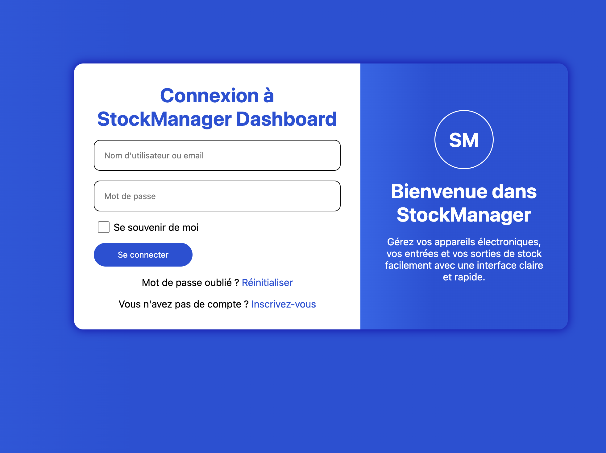

# Stock Manager

## Structure du Projet(login)

```
<body>
│
└── <div class="carte-standard">
    │
    ├── <div class="connexion">
    │   │
    │   ├── <h1> Connexion à StockManager Dashboard </h1>
    │   │
    │   └── <form>
    │       │
    │       ├── <input type="text">
    │       ├── <input type="password">
    │       │
    │       ├── <section class="checkbox">
    │       │     ├── <input type="checkbox">
    │       │     └── <label> Se souvenir de moi </label>
    │       │
    │       └── <button>
    │             └── <a href="dashbord/dashbord.html"> Se connecter </a>
    │
    │   ├── <p> Mot de passe oublié ? <a> Réinitialiser </a> </p>
    │   └── <p> Vous n'avez pas de compte ? <a> Inscrivez-vous </a> </p>
    │
    │
    └── <div class="titre">
        │
        ├── <section>
        │     └── <h1> SM </h1>
        │
        └── <section>
              ├── <h1> Bienvenue dans StockManager </h1>
              └── <p> Texte d'explication... </p>
```


## Image(login)




## Propriétés CSS 


1. Mise en page (layout)
display

Définit la façon dont un élément est affiché.
Exemples :

block = prend toute la largeur

flex = active le flexbox

inline = se met dans la ligne

grid = active grid

position

Contrôle la position d’un élément.
Valeurs :

static (par défaut)

relative (se déplace par rapport à lui-même)

absolute (par rapport au parent positionné)

fixed (toujours visible même en scroll)

sticky (collé quand on scroll)

float

Ancienne façon de placer des éléments.
Déplace un élément à gauche ou droite.

z-index

Contrôle la profondeur (qui passe devant / derrière).
Plus le nombre est grand → plus c’est au-dessus.

width / height

Largeur et hauteur d’un élément.
Peuvent être en px, %, rem, etc.

margin

Espace extérieur entre un élément et les autres.

padding

Espace intérieur entre le contenu et les bords.

gap

Espace entre les éléments dans un display: flex ou display: grid.

2. Style visuel
background

Définit l’arrière-plan (couleur, image, gradient…).
Ex : background: #fff;

color

Couleur du texte.

border

Ajoute une bordure (épaisseur, style, couleur).
Ex : border: 1px solid #333;

border-radius

Arrondit les angles.
Ex : border-radius: 50% pour faire un cercle.

box-shadow

Crée une ombre autour des éléments.
Très utilisé pour les cartes, boutons et modals.

opacity

Définit la transparence (0 = invisible, 1 = opaque).

backdrop-filter

Applique un effet derrière un élément.
Ex : backdrop-filter: blur(5px); → flou d’arrière-plan.
(Tu l’utilises pour ton pop-up 💙)

filter

Applique un effet directement sur l’élément (flou, luminosité…).

3. Texte et typographie
font-size

Taille du texte.

font-weight

Épaisseur du texte (bold, normal, ou un chiffre).

text-align

Alignement (gauche, droit, centre, justify).

line-height

Hauteur de ligne → espace entre les lignes.

letter-spacing

Espace entre les lettres.

4. Flexbox (tu l'utilises souvent) 🎯
display: flex

Active le mode flex.

justify-content

Aligne les éléments horizontalement.

align-items

Aligne les éléments verticalement.

flex-direction

Oriente les éléments :

row (horizontal)

column (vertical)

5. Pour les modals (ce que tu utilises)
position: fixed

Rend la modale visible même quand on scroll.

top, left, right, bottom

Définit la position exacte.

transform: translate()

Permet de centrer ou déplacer un élément sans casser la mise en page.
Ex : translate(-50%, -50%)

6. Animations
transition

C’est la douceur d’un changement.
Ex :
transition: background 0.2s;
→ Quand la couleur change, elle glisse en douceur.

animation

Définit une animation complète (avec des @keyframes).

